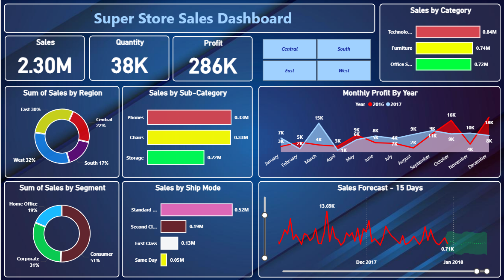

# Power-BI-Dashboard-Superstore-sales-

🚗 Superstore Sales Dashboard - Power BI Project

This repository contains a Power BI dashboard and the Superstore dataset, providing insights into sales, profit, orders, product categories, shipping modes, and regional performance. The dashboard is designed with interactive charts, filters, and drill-downs for in-depth analysis of business performance.

📁 Files in this Repository
File Name	Description
Superstore_Sales Dashboard.pbix	Power BI dashboard file with visualizations and analysis
Sample - Superstore.csv	Raw dataset containing Superstore sales data
link of dashboard.txt	Contains a link to the published version of the dashboard
Screenshot/pic.png	First screenshot of the Power BI dashboard

🖼️ Dashboard Screenshots

Below are screenshots of the Power BI dashboard:

### 📌 Dashboard Preview 1

🖥️ Live Dashboard (Web Version)

You can view the interactive dashboard directly online without needing Power BI Desktop:

🔗 View Dashboard Online :- https://app.powerbi.com/view?r=eyJrIjoiZDEyNjJkM2EtMjI4OS00NzA1LThlNTMtYzg0ZmUzN2IzZmI0IiwidCI6Ijc1ZGYwOTZjLThiNzItNDhlNC05YjkxLWNiZjc5ZDg3ZWUzYSIsImMiOjl9

📄 The published link is also included in the file: dashboard url link.txt.

📊 Project Overview

This project aims to visualize and analyze Superstore sales data using Power BI. The dashboard helps stakeholders and decision-makers:

Track key performance metrics: Sales, Profit, Quantity

Monitor monthly profit trends (2016 vs 2017)

Analyze sales by region and customer segment

Identify best-performing categories & sub-categories

Evaluate shipping modes impact on sales

Forecast short-term sales (15-day forecast)

🔍 Dataset Description

The dataset superstore_orders.csv includes various fields related to orders and sales. Sample fields:

Order ID: Unique identifier for each order

Order Date: Date of the order

Customer ID: Unique customer reference

Segment: Customer segment (Consumer, Corporate, Home Office)

Category/Sub-Category: Product classification

Region: East, West, Central, South

Sales: Revenue generated

Profit: Profit from the order

Quantity: Units sold

Ship Mode: Standard, Second Class, First Class, Same Day

📈 Dashboard Features

The dashboard built in Power BI (Superstore_Sales.pbix) offers:

🔑 Key Metrics

Sales: 2.30M

Quantity: 38K

Profit: 286K

📊 Visual Insights

Sales by Category: Technology (0.84M), Furniture (0.74M), Office Supplies (0.72M)

Sales by Sub-Category: Phones (0.33M), Chairs (0.33M), Storage (0.22M)

Sales by Region: East (30%), West (32%), Central (22%), South (17%)

Sales by Segment: Consumer (51%), Corporate (31%), Home Office (19%)

Sales by Ship Mode: Standard (0.52M), Second Class (0.19M), First Class (0.13M), Same Day (0.05M)

Monthly Profit by Year: Comparison of 2016 vs 2017 (peak profit in Dec 2017: 18K)

Sales Forecast (15 Days): Forecast showing expected sales growth in early 2018

🎛️ Filters and Slicers

Date Range

Region

Category / Sub-Category

Segment

Ship Mode

🎨 Modern UI/UX

Clean, dark-themed layout with vibrant visuals

Interactive charts with drill-down capabilities

Forecasting and trend analysis features